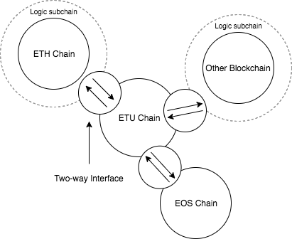
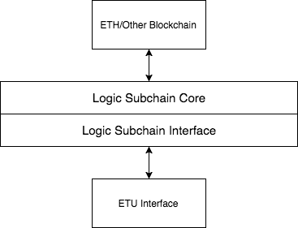

# ETU Technical White Paper

February 27, 2018

**Abstract:** Ether Universe is designed to provide a capable and robust cross-chain solution based on EOS. This is done with logic subchains of different blockchains and sidechains based on EOS. The structure will enable account authentication and the exchange of value among various blockchains, and will eventually provide end users with a light client. Ether Universe itself is a cross-chain platform, providing status channels and service APIs so that anyone can develop their applications on Ether Universe. Ether Universe is dedicated to promote blockchain technology its business applications.

[TOC]

## Background

Nowadays, several teams have engaged in developing cross-chain solutions, e.g. BTCRelay, BlockStream, Lisk, and Asch. They all presented excellent technical progression and have gained tremendous influence.

EOS represents the right direction of the evolution of blockchain technology, based on its philosophy of general validation, progressive iteration, and long-term evolution. The purpose of EOS is to offer million-scale high-volume capacity, accounts system, free use, easy upgrade, restoration from bugs, low-latency, and combination of high performance in both serial and parallel computations. Ether Universe will inherit the essential features of EOS and will construct a distinct cross-chain platform, eventually enabling the exchange of value across blockchains.

## Inter Blockchain Communication

In the BTCRelay solution, events (e.g. generation of blocks and transactions) in the basechain are validated with SPV Proofs by sidechains. As sidechains are anchored on Bitcoin, users are allowed to verify Bitcoin transactions over Ethereum with smart contracts. This was the first effective attempt and it was truly ambitious.

### Communicate With Other Blockchain

Ether Universe intends to enable the exchange of value across non-specific blockchains. In order to do this, we will first implement a logic subchain based on Ethereum or another blockchain. The logic subchain is employed to set two-way anchoring with other blockchains (basechains), which thereby enables associating transactions, including locking. Ether Universe communicates with EOS basechain over the cross-chain communication protocol of EOS.

#### Participants

Logic subchains delegates the supervision power of tokens to the miners on the platform, allowing the miners to vote to determine where to send the unlocked tokens. Miners do voting with certain fields on the blockchain. The more workers engage in the voting, the more secure the system is.

#### Reward/Punishment Mechanism

Ether Universe employs a reward-punishment mechanism, in which all who engage in verification shall have their rewards according to the rules. Vice versa, the system will punish the witnesses and the miners who fail to fulfill their responsibilities. The system will first decrease their credibility. One's credibility will directly affect the weights and rewards of the participant. If a witness makes too many false statements (e.g. providing invalid block proofs), the system will confiscate its deposit.

### Communicate With EOS

## ETUChain

Ether Universe is a public chain based on EOS, and the distinct cross-chain features are developed upon the foundation of EOS. EOS is capable of serving millions of users, and its service is provided for free. Additionally, upgrading and restoration from bugs are made easy. Its low-latency and high performance in both serial and parallel computations are remarkable. Ether Universe takes advantage of the excellent capacity of EOS to provide high-volume, high-speed, low-latency data services.

### ETUChain Core

The core of ETUChain is built on EOS with DPOS, fulfilling high-performance requirement and supporting major features of EOS, including accounts system, application certainty, parallel execution, token models, resource management, scripts, virtualization, and cross-chain communications.

#### Share Computing Resources

ETUChain has independent committee, witness, computational resources, currency, and currency supplying mechanism. ETU tokens can be anchored to EOS over an API to enable associating transactions, including locking. The suppliers of computational resources can either provide them to EOS or to Ether Universe.

#### Communication confirmed

The communications between Ether Universe and EOS are solely administered by miners. When communicating with other blockchains, witnesses and guarantors are used, in order to ensure that the system may not be compromised when only few miners work. Guarantors need to make a deposit for security, and the witnesses need to fulfill their witnessing responsibility by voting with signed votes. Ether Universe received the voting information from miners on different blockchains and verify with the voting information provided by the witnesses, eventually making consensus.

#### Delayed 

Ether Universe is designed to enabled the exchange of information across different blockchains. miners must wait until there is 100% certainty that a transaction has been irreversibly confirmed by the other blockchain before accepting it as a valid input. When communicating with EOS, with 21 miners and delegation proofs, it will take approximately 45 seconds to confirm. If a chain of miners do not wait for confirmation of the transaction, like a transaction is accepted and the withdrawal of this operation, which will affect the validity of chain consensus. communicating with other types of blockchain, depending on notary and miners' confirmation times, our estimated times are as follows:

Latency = 45 seconds + verifiers * Pt1 + Witnesses * Pt2

Where Pt1 and Pt2 is determined by the weights.

### ETUChain Interaction

ETUChain relies on extended APIs for communications with other blockchains. ETUChain employs a series of APIs and logic subchain communications to enable the exchange of information across blockchains. These APIs will have the following features:

#### Complete Functionalities 

It is necessary to consider the variance of architectures of different blockchains. When designing the APIs for cross-chain communications, functionality completeness is necessary.

#### Extensibility

Ether Universe is designed to be compatible with all blockchains. In future, increasingly more blockchains will be developed.

### ETUChain Services

ETUChain itself is a platform dedicated to provide more users and applications with information exchange services across blockchains.

ETUChain provides external services like status channels and service APIs. Over Ether Universe, any EOS application can use the platform to build cross-chain information exchange applications.

#### Application

Ether Universe will provide basic applications upon itself, e.g. clients for making cross-chain transfers. The client will be totally open source, offering competent support for the entire ecosystem.

## Logic Subchain

Logic subchain is an important component in the interaction between ETUChain and other blockchains. Since the very beginning of the ideation, Ether Universe is supposed to serve as bridges among blockchains, in which a unified protocol is used to exchange information. Such a bridge is called a logic subchain. ETUChain can make two-way anchoring through logical components.

### Logic Subchain Core

On different blockchains, the number of logic subchain cores may differ. Ether Universe is designed to offer different logic subchain cores, ensuring compatibility across different blockchains with a reduced instruction-set virtualization technology. Logic subchains need to cooperate with the basechain in order to let miners vote for confirming, locking, and unlocking.

### Miner verification

### Logic Subchain Interface

Matching the extended APIs of ETUChain, all logic subchains are guaranteed to have consistent APIs. At the beginning, we will need locking, miner information confirmation, unlocking, etc.

## Accounts

### Account Link

Ether Universe allows all accounts to have a human-readable name to index, with 2 to 32 characters. This name is determined by the creator. Ether Universe abstracts accounts on Ethereum and other blockchains into one single account in transactions, and specifies a single key-pair. The user may access logic subchains on different blockchains with the key-pair to exchange information.

### Account Management

Ether Universe takes the advantage of EOS to enable management of multiple accounts. Beyond that, Ether Universe allows users to manage other accounts in other blockchains under the current account.

## Light Client

### Based on LCV client

It will be easier to incorporate different blockchains if the client is free from processing the transactions of the entire network. For an end user, the user's own transactions are more important than the transactions of the entire network. ETUChain makes use of LCV to reduce the necessity to trust the producers of other blocks, further allowing producers of their own blocks minimize the cost of synchronizing with others.

Ether Universe will provide a series of easy-using client apps. They will support major operating systems.

### Proof of Completion

Ether Universe supports communications across blockchains. A unique ID will be assigned to each transaction, which will be verified by miners. With the unique ID, users can identify a particular transaction and verify that a list of given transaction are processed in the expected order.

## Conclusion

Ether Universe, in combination with exciting features of EOS, will contribute to blockchain technology significantly, and will serve an even broader user base.